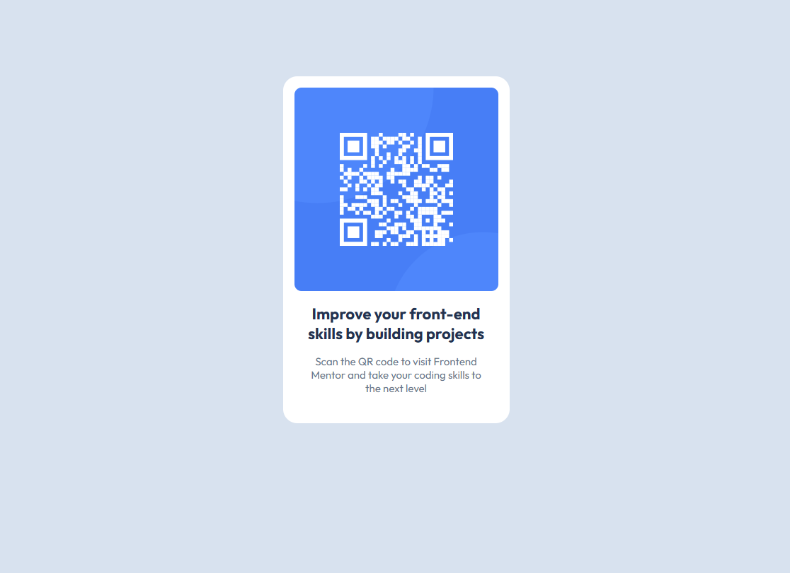

# Frontend Mentor - QR code component solution

This is a solution to the [QR code component challenge on Frontend Mentor](https://www.frontendmentor.io/challenges/qr-code-component-iux_sIO_H). Frontend Mentor challenges help you improve your coding skills by building realistic projects. 

## Table of contents

- [Overview](#overview)
  - [Screenshot](#screenshot)
  - [Links](#links)
- [My process](#my-process)
  - [Built with](#built-with)
  - [What I learned](#what-i-learned)
  - [Continued development](#continued-development)
- [Author](#author)
- [Acknowledgments](#acknowledgments)

**Note: Delete this note and update the table of contents based on what sections you keep.**

## Overview

### Screenshot

### Links

- Solution URL: [solution URL](https://www.frontendmentor.io/solutions/responsive-qr-code-component-EpPDFUF5mI)
- Live Site URL: [live site URL](https://spidz-world.github.io/qr-code-component/)

## My process

- HTML first
- Then CSS

### Built with

- Semantic HTML5 markup
- CSS custom properties
- Flexbox

### What I learned

It's been a while since I last coded, so thought I'd do a light challenge to get back on track. The journey begins.

### Continued development

Let's work on more projects.

## Author

- Frontend Mentor - [@yourusername](https://www.frontendmentor.io/profile/CarltonMpofu)

## Acknowledgments

I would like to thank God for this wonderful day and the opportunity to complete this project.

